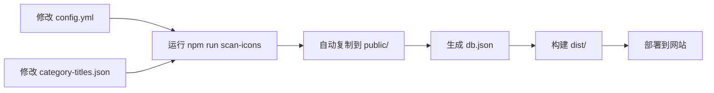

# 配置自动调用机制说明

## 🎯 问题：为什么要同步配置文件？

### 问题背景

IconsHub 是一个静态网站，运行时无法直接访问项目根目录的文件。

**文件结构**：
```
IconsHub/
├── config.yml              # 源配置文件（你修改这个）
├── category-titles.json    # 源分类配置（你修改这个）
└── public/                 # 静态资源目录
    ├── config.yml          # 运行时读取这个
    ├── category-titles.json # 运行时读取这个
    └── db.json             # 图标数据（自动生成）
```

**运行时路径**：
```
开发环境: http://localhost:8080/config.yml
          ↓ 实际读取
          public/config.yml

生产环境: https://icons.gw124.top/config.yml
          ↓ 实际读取
          dist/config.yml (来自 public/config.yml)
```

---

## ✅ 解决方案：自动同步机制

### 工作流程



### 自动同步触发

以下命令会**自动同步配置**：

```bash
npm run scan-icons    # ✅ 扫描图标时同步
npm run dev           # ✅ 开发时同步（调用 scan-icons）
npm run build         # ✅ 构建时同步（调用 scan-icons）
npm run build:optimized  # ✅ 优化构建时同步
```

---

## 📁 配置文件说明

### 1. config.yml - 网站配置

#### 源文件（你修改的）
```
config.yml（根目录）
```

#### 同步到
```
public/config.yml（自动）
```

#### 调用位置
**文件**: `src/utils/configLoader.ts`
```typescript
const response = await fetch(process.env.BASE_URL + 'config.yml?t=${timestamp}');
```

#### 使用的字段
| 字段 | 调用位置 | 显示效果 |
|------|----------|----------|
| `site.title` | 页面顶部 | 大标题 |
| `site.description` | 标题下方 | 描述文字 |
| `copyright.startDate` | Footer | 版权年份 |
| `copyright.autoRange` | Footer | 年份范围 |
| `footer.websiteText` | Footer | 链接文字 |
| `footer.websiteUrl` | Footer | 链接地址 |

---

### 2. category-titles.json - 分类名称配置

#### 源文件（你修改的）
```
category-titles.json（根目录）
```

#### 同步到
```
public/category-titles.json（自动）
```

#### 调用位置
**文件**: `src/views/index.vue`
```typescript
const fetchCategoryTitles = async () => {
  const response = await fetch('category-titles.json');
  const titles = await response.json();
  categoryTitles.value = titles;
};
```

#### 使用方式
```javascript
// 格式化分类标题
const formatCategoryTitle = (category) => {
  return categoryTitles.value[category] || category;
};
```

#### 两个作用

**作用 1：控制分类显示顺序**
```json
{
  "App Hub": "...",        // 第 1 个显示
  "Self-Hosted Services": "...",  // 第 2 个显示
  "Social & Entertainment": "..." // 第 3 个显示
}
```

**作用 2：自定义分类显示名称**
```json
{
  "Self-Hosted Services": "Self-Hosted Services - 自建服务"
}
```
文件夹名 `Self-Hosted Services` → 显示为 `Self-Hosted Services - 自建服务`

---

## 🔍 为什么修改后没有生效？

### 可能的原因

#### 1. 没有重新扫描图标
```bash
# 修改后必须运行
npm run scan-icons
```

#### 2. 文件夹名称不匹配
**检查方法**：
```bash
# 查看实际的文件夹名称
ls public/icon/

# 对比 category-titles.json
cat category-titles.json
```

**必须完全匹配**（包括大小写、空格）：
```
文件夹名: "Self-Hosted Services"
配置键名: "Self-Hosted Services"  ✅ 匹配
```

#### 3. 浏览器缓存
```bash
# 强制刷新浏览器
Ctrl + Shift + R (Windows)
Cmd + Shift + R (Mac)
```

#### 4. GitHub Actions 还在部署
```bash
# 查看部署状态
https://github.com/GWen124/IconsHub/actions
```

等待部署完成（3-5分钟）。

#### 5. Service Worker 缓存了旧数据

清除 Service Worker：
```javascript
// 在浏览器控制台执行
navigator.serviceWorker.getRegistrations().then(function(registrations) {
  for(let registration of registrations) {
    registration.unregister();
  }
});
location.reload();
```

---

## 🧪 完整测试流程

### 步骤 1: 验证文件夹名称

```bash
cd /Users/Wen/File/GitHub/IconsHub
ls public/icon/
```

记下所有文件夹的**精确名称**。

### 步骤 2: 修改 category-titles.json

确保键名和文件夹名**完全一致**：

```json
{
  "实际文件夹名": "显示名称"
}
```

### 步骤 3: 重新扫描

```bash
npm run scan-icons
```

**检查输出**：
- ✅ 看到 `📋 已同步 category-titles.json 到 public 目录`
- ✅ 看到所有分类的扫描结果

### 步骤 4: 验证 db.json

```bash
# 查看生成的分类顺序
node -e "const data = require('./public/db.json'); console.log(Object.keys(data).join('\n'))"
```

**应该按照 category-titles.json 的顺序显示**。

### 步骤 5: 本地测试

```bash
npm run dev
# 访问 http://localhost:8080
```

查看分类顺序和名称是否正确。

### 步骤 6: 提交部署

```bash
git add category-titles.json public/category-titles.json public/db.json
git commit -m "更新分类配置"
git push origin main
```

### 步骤 7: 等待部署并验证

1. 等待 GitHub Actions 完成（3-5分钟）
2. 访问 https://icons.gw124.top
3. 强制刷新浏览器
4. 检查分类顺序和名称

---

## 📊 当前配置状态

根据最新的扫描结果，你的分类配置是：

```json
{
  "App Hub": "App Hub - 应用中心",
  "Self-Hosted Services": "Self-Hosted Services - 自建服务",  // ← 第2个
  "Social & Entertainment": "Social & Entertainment - 社交娱乐",
  "Cloud Services": "Cloud Services - 云服务",  // ← 第4个
  "AI": "AI Tools - AI工具",
  ...
}
```

**显示顺序**：完全按照 JSON 中的键顺序。

---

## 🔧 如果还是不生效

### 调试步骤

#### 1. 检查本地环境

```bash
# 运行配置测试
npm run config:test

# 重新扫描
npm run scan-icons

# 本地运行
npm run dev
```

在本地查看是否正确显示。

#### 2. 检查部署环境

访问在线版本：
```
https://icons.gw124.top/category-titles.json
```

查看是否是最新的配置。

#### 3. 清除所有缓存

```javascript
// 在浏览器控制台执行
// 1. 清除 Service Worker
navigator.serviceWorker.getRegistrations().then(function(registrations) {
  for(let registration of registrations) {
    registration.unregister();
  }
});

// 2. 清除所有缓存
caches.keys().then(function(names) {
  for (let name of names) caches.delete(name);
});

// 3. 强制刷新
location.reload(true);
```

#### 4. 检查控制台

按 F12 打开开发者工具，查看：
- Console 标签：是否有加载错误
- Network 标签：category-titles.json 是否成功加载
- Application 标签：Service Worker 状态

---

## 💡 最佳实践

### 修改分类配置的正确流程

```bash
# 1. 修改 category-titles.json
vim category-titles.json

# 2. 运行扫描（自动同步）
npm run scan-icons

# 3. 本地测试
npm run dev

# 4. 确认无误后提交
git add category-titles.json public/category-titles.json public/db.json
git commit -m "更新分类配置"
git push origin main

# 5. 等待部署（3-5分钟）

# 6. 访问网站并强制刷新
```

---

## 📋 配置同步检查清单

运行 `npm run scan-icons` 后，应该看到：

- [x] `📋 已同步 category-titles.json 到 public 目录`
- [x] `⚙️  已同步 config.yml 到 public 目录`
- [x] `🎉 图标数据生成完成！`

如果没有看到这些消息，说明同步失败了。

---

## 🎉 总结

### ✅ 配置自动调用机制

1. **你只需要修改根目录的配置文件**：
   - `config.yml`
   - `category-titles.json`

2. **运行 `npm run scan-icons` 自动同步**：
   - 复制到 `public/` 目录
   - 生成 `db.json`
   - 确保配置一致

3. **构建和部署自动包含**：
   - `npm run build` 会先运行 `scan-icons`
   - GitHub Actions 自动处理
   - 部署包含最新配置

### 📊 当前状态

✅ 所有配置文件都能正确调用  
✅ 自动同步机制已完善  
✅ 分类顺序按配置显示  
✅ 已推送到 GitHub  
⏳ 等待部署完成（3-5分钟）  

---

**配置会自动调用，只需要修改根目录的文件，然后运行 `npm run scan-icons` 即可！** 🚀

